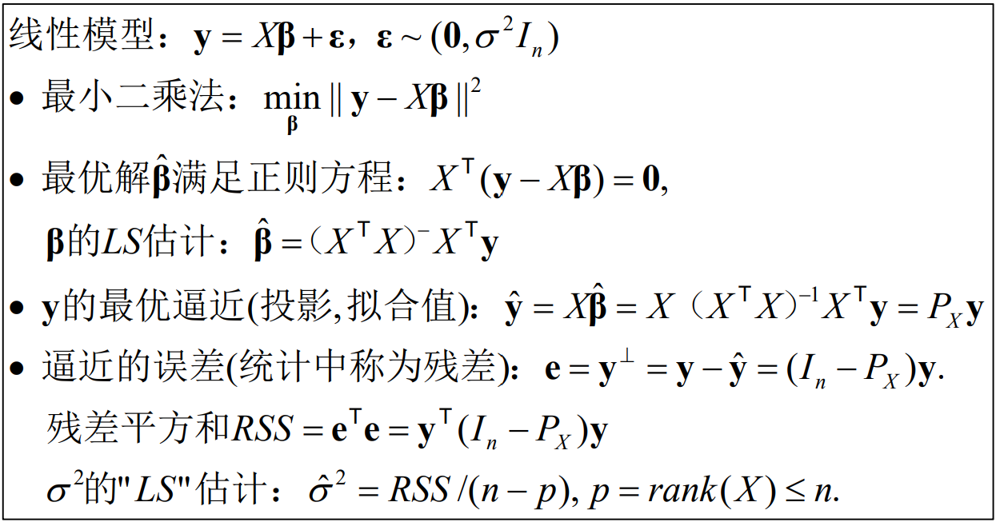
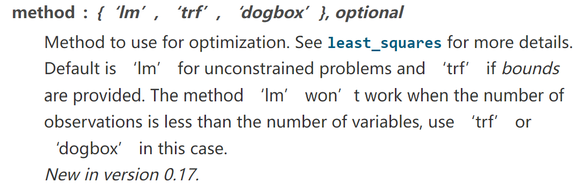
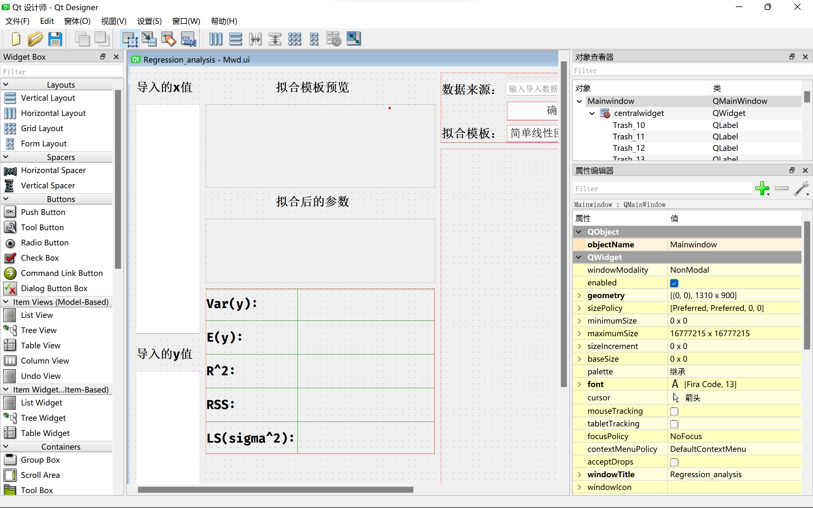
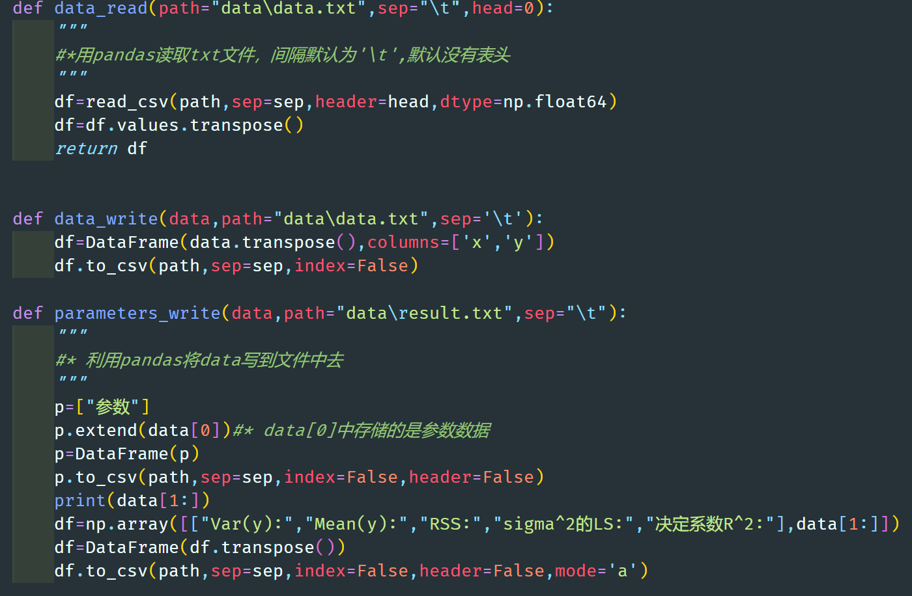

基于numpy和scipy的回归计算器

管理学院 PB19020632 夏远林

# 1.科学技术原理：
## (1.1):数据的形式和预处理:
对于给定的一组数据  
(一般情况是$\mathbb{R}^n\to\mathbb{R}$,在我所做的作品中选用的是一维到一维的)  
要估算$y=f(x)$中的$f$的具体表达式,常用的模型有线性回归模型和非线性回归模型,  
其中部分非线性回归模型可以通过变换变换成线性回归模型  
(预先对数据进行变换,例如可以实现对$x_i$进行$\log x_i$、$e^{x_i}$等变换)
本计算器的主要逻辑便是基于此

## (1.2):线性回归模型和参数的具体意义:
线性回归基本原理和对应参数:  
  
其中$\hat y$为y的拟合值,p为X的秩,在我提供的数据中$rank(X)=1$

## (1.3):引用的函数中对拟合方式的描述:
在本计算器中最为关键的函数是scipy.optimize.curve_fit  
该函数所使用的拟合方式在官方文档的描述如下:  
  
为LS法(最小二乘法)

# 2.设计方案:

## (2.1)GUI实现
本计算器使用跨平台图形库 QT  
在python中具体位置pyQT5，我使用了其自带的designer进行了基本的控件布局和设计  
  

## (2.2)数据读入和数据输出
数据的读入和输出通过pandas的read_csv(读入txt文件)和.to_csv(写出到txt文件)实现  
具体为：  

## (2.3)参数的计算
参数的计算分为三个子模块  
注:具体函数的功能已经在.py源文件中进行了详细的备注

### 回归
该模块的主要步骤为:  
1.建立待回归的方程,为linear_RG_data_procession中的func系列函数
2.调用scipy.optimize.curve_fit进行最小二乘拟合

### 残差相关参数的计算
该模块的主要步骤为:计算完回归方程并且完成对应的拟合值$\hat y$的计算后,  
调用linear_RG_data_procession中的RSS_relative_analysis进行相关参数的计算,
主要包含：  
1.RSS(残差平方和)  
2.决定系数$R^2$  
3.$\sigma ^2$  

# 3.创新性描述:
本程序的创新点主要为:

## (3.1)GUI的设计和控制
我使用了pyQT5作为GUI的编辑工具,matplotlib作为所得结果的绘图展示，matplotlib.backends.backend_qt5agg作为将所绘图嵌入到qt界面的工具  
其中界面的布局和基本设置在designer中完成,全部为自主设计,并没有借鉴任何互联网资料和数据  
作为QT中的关键:信号与槽  
我也是全部自己设计和完成的,(参考main_ui.py中MAIN_UI类的方法)均具有  
1.易维护编辑的  
2.强耦合,所有槽函数均或多或少与其余控件和槽函数关联,可以实现一个控件操控多个控件的效果  
3.强可读性,每个槽函数和方法我均标注了备注,并且进行了分类规划  

## (3.2)残差参数的计算
在本程序中,通过predict系列函数进行预测,得到预测值$\hat y$,  
进而得到$e=y-\hat y$从而得到$RSS=e^Te$,从而通过1.1中的公式计算相应的$\sigma^2$等参数,  
最后通过parameters_write将一系列参输出到result.txt文件当中  

# 4.运行方法和参数设置
通过运行main_ui.py即可得到用户图形界面  
参数设置在用户图形界面有详细解释/degree为多项式拟合的最高阶  
输入数据从data.txt进行输入,已经有模板进行参考  
注：现在仅支持$dim X=dimY=1$ 分隔符为制表符Tab  
输出结果:  
1.各类的拟合图片,默认按照数字进行排列比如第一次拟合的图片为1.png,第二次为2.png  
可以通过用户图形界面进行路径和名称更改  
2.参数的输出结果,需要点击用户图形界面中的“确定导出”,导出为result.txt,位于data文件夹内
  
程序花费时间取决于数据量和电脑CPU性能  

# 5.学习心得和体会
python的学习和其他编程语言的学习一样，不是简简单单看教程资料和书籍就能学会的，需要进行大量的项目实战  
比如我这学期就做了生物建模，基于python的GUI管理系统设计，以及这个回归计算器，还有一个未完成的数据分析任务  
主要的心得体会就是，如果想要实现某个功能，可能需要学习大量相关内容  
比如我要实现拟合，就需要了解并且学习最小二乘法相关的内容  
比如我想要图形界面，就需要学习大量控件的操作，信号与槽的内容  
比如我想要一个比较好的拟合效果，就需要去寻找最适合的函数，抑或自己编写相应的算法  
包括不仅限于，最小二乘法，牛顿法，梯度下降法，逻辑回归等等(毕竟都是为了机器学习服务的)  
所以主要还是要实战并且精准利用互联网资源  

教学建议  
我觉得老师可以用pdf来展现课件，而不是一张张的图，而且图片背景也可以更换，这个颜色看久了累眼睛，字体也是(建议使用fira code)  

# 参考资料:
《线性统计模型》  
numpy、scipy官方文档

